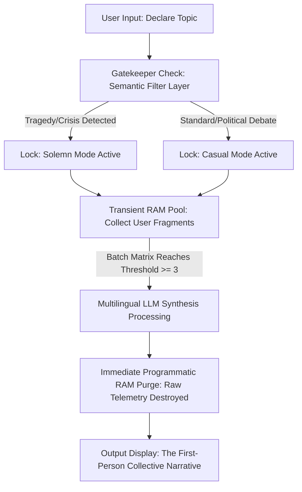

# 🪞 The Mirror - Collective Intelligence: An Ephemeral Collective Intelligence Platform

Project Mirror is a privacy-first, context-aware Artificial Intelligence system designed to synthesize fragmented public sentiments into a unified, first-person narrative without leaving a digital footprint. Built using Streamlit and powered by the Llama 3.1 architecture, it introduces a novel approach to public discourse analysis, stripping away algorithmic manipulation and user telemetry.

> **Architectural Achievement:** Project Mirror is a pioneering, context-aware cognitive computing platform designed to solve a critical paradigm in modern Natural Language Processing (NLP): **Synthesizing multi-agent public discourse into a singular collective consciousness while mathematically guaranteeing total user anonymity.**

Unlike traditional sentiment analysis tools that merely output sterile data charts or percentages, Mirror leverages **Advanced Linguistic Ingestion via Llama 3.1** to dynamically construct an internalized, first-person narrative ("I"). It acts as a digital sieve, filtering out toxic noise, neutralizing hardcoded political bias, and reflecting the genuine psychological state of a community in real-time. 

### 🌟 Core Innovations & Engineering Highlights
* **Zero-Telemetry Ephemeral Storage:** Engineered a custom Volatile Memory State (RAM-Only). The platform programmatically eradicates all raw source data vectors the exact millisecond the 3-input batch processing threshold is met.
* **Algorithmic Adaptability (The Gatekeeper):** Features a sub-token greedy decoding semantic safety filter. It calculates the emotional gravity of topics in real-time, instantly shifting the system persona between an ironically detached digital native (Casual Mode) and a deeply empathetic, solemn community voice (Solemn Mode) to prevent ethical alignment failures.
* **Dialectical Synthesis Engine:** Flawlessly resolves conflicting sociological viewpoints (e.g., radical optimism vs. systemic cynicism) into a continuous, logically fluid narrative stream without relying on bullet points or sterile summaries.

## 🚀 Live Demo
Access the production environment here: 
---

## 🧪 Interactive Validation Guide (How to Test the Live App)

To demonstrate the precision of the **Gatekeeper Protocol** and the **Dialectical Synthesis Engine**, you can perform an immediate runtime verification on the live server using the following protocol:

### Step 1: Initialize the Target Matrix Focus
1. Click the **Live Demo** link at the top of this repository.
2. In the initialization screen, input a complex socio-political or macroeconomic topic. 
   * *Recommended Test Case:* `The New Macroeconomic Reforms and Tax Regulations`

### Step 2: Inject 3 Conflicting Thought Fragments
The system requires a batch size of **exactly 3 input fragments** to trigger the memory consolidation loop. Copy and commit the following three highly contrasting, raw inputs into the volatile memory pool one by one:

* **Fragment 1 (Select Emoji 😠):** *"This regulation is a death sentence for the middle class. You cannot stabilize an economy by systematically suffocating the honest taxpayers while corporate monopolies enjoy tax exemptions. This is economic injustice, plain and simple."*
* **Fragment 2 (Select Emoji 🤔):** *"We are masking structural bankruptcy with aggressive taxation. The government has completely lost its grip on inflation, and now they are forcing the citizens to pay for their catastrophic policy errors. The trust between the state and the public is completely broken."*
* **Fragment 3 (Select Emoji 😔):** *"I am working 60 hours a week and I can't even afford baseline groceries because of these new brackets. This layout doesn't reform anything; it just institutionalizes poverty. We are being pushed to the absolute edge."*

### Step 3: Observe the Collective Realization
Once the 3rd fragment is committed, the volatile memory pipeline will automatically fire. Observe how the system:
1. Operates under **Casual Persona Protocol** (identifying it as political/economic discourse rather than a tragedy).
2. Completely purges the individual text inputs from server memory (check the **Architectural Monitor** sidebar to see the load drop to `0 / 3`).
3. Generates a flawless, high-fidelity first-person monologue under **🎯 The Collective Reflection**, weaving your custom metaphors into an elegant, unified sociological output.

---

## 🛠️ Architectural Core

### 1. Volatile Memory Architecture (Privacy by Design)
Traditional social media networks capitalize on storing raw, identifiable user data for behavioral tracking. Project Mirror operates entirely on a **Volatile Memory State (RAM-Only)**. 
* Individual comment fragments and emotional data points reside strictly within transient user session states.
* The moment the platform reaches its processing threshold (3 accumulated inputs), the linguistic model ingests the batch, generates the collective reflection, and **immediately executes a programmatic wipe of all raw input data**.

### 2. Semantic Safety Filter (The Gatekeeper)
To eliminate the ethical catastrophe of algorithmic tone-deafness (e.g., applying satirical or casual tones to societal tragedies), the pipeline includes a pre-processing inference layer:
* **Casual Persona Matrix:** Applied to open debates, cultural topics, or everyday discourse. Employs unpolished social media aesthetics, natural lowercases, and sharp irony.
* **Solemn Persona Matrix:** Automatically triggered by the Gatekeeper upon discovering themes related to tragedy, grief, loss, or disasters. The AI personality instantly adapts into a dignified, respectful, and empathetic communal voice.

---

## 📊 System Topology

---

🚀 Core Technologies

Frontend/State Management: Streamlit (Session State Handling)

LLM Core Provider: Groq Inference Engine

Model Pipeline: Llama 3.1 8B Instant (Ultra-low latency inference, optimized at temperature=0.0 for safe gatekeeping)

Language Logic: Bi-directional Multilingual Synthesis (English & Turkish native adaptation)

🔮 Future Roadmap

Daily Reset Protocol: Implementing automated 24-hour global matrix purges to log the "Soul of the Day" into a read-only historical archive.

Community Validation Layer: Allowing decentralized users to vote on whether the AI synthesis accurately represents the collective heartbeat or requires refinement.

---
🛡️ License: This project is licensed under the GNU GPL v3, see the LICENSE file for details. Any derivative commercial work must also be open-sourced.
