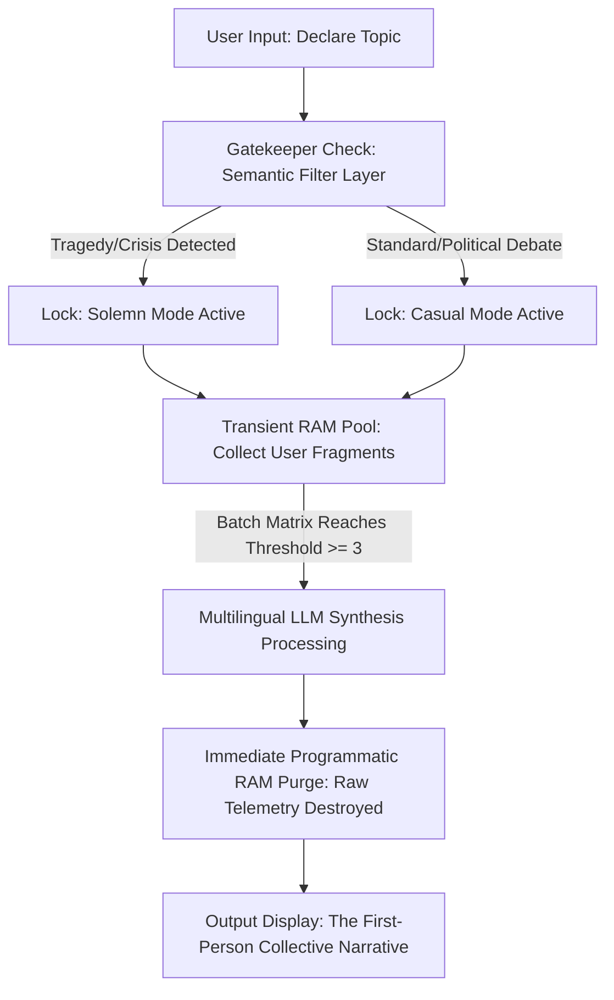

# 🪞 The Mirror - Collective Intelligence: An Ephemeral Collective Intelligence Platform

Project Mirror is a privacy-first, context-aware Artificial Intelligence system designed to synthesize fragmented public sentiments into a unified, first-person narrative without leaving a digital footprint. Built using Streamlit and powered by the Llama 3.1 architecture, it introduces a novel approach to public discourse analysis, stripping away algorithmic manipulation and user telemetry.

## 🚀 Live Demo
Access the production environment here: **[(https://mirror-collective-intelligence-pzxvs3cdytvsdv8tu4ersw.streamlit.app/)]**

---

## 🛠️ Architectural Core

### 1. Volatile Memory Architecture (Privacy by Design)
Traditional social media networks capitalize on storing raw, identifiable user data for behavioral tracking. Project Mirror operates entirely on a **Volatile Memory State (RAM-Only)**. 
* Individual comment fragments and emotional data points reside strictly within transient user session states.
* The moment the platform reaches its processing threshold (3 accumulated inputs), the linguistic model ingests the batch, generates the collective reflection, and **immediately executes a programmatic wipe of all raw input data**.

### 2. Semantic Safety Filter (The Gatekeeper)
To eliminate the ethical catastrophe of algorithmic tone-deafness (e.g., applying satirical or casual tones to societal tragedies), the pipeline includes a pre-processing inference layer:
* **Casual Persona Matrix:** Applied to open debates, cultural topics, or everyday discourse. Employs unpolished social media aesthetics, natural lowercases, and sharp irony.
* **Solemn Persona Matrix:** Automatically triggered by the Gatekeeper upon discovering themes related to tragedy, grief, loss, or disasters. The AI personality instantly adapts into a dignified, respectful, and empathetic communal voice.

---

## 📊 System Topology

---

🚀 Core Technologies

Frontend/State Management: Streamlit (Session State Handling)

LLM Core Provider: Groq Inference Engine

Model Pipeline: Llama 3.1 8B Instant (Ultra-low latency inference, optimized at temperature=0.0 for safe gatekeeping)

Language Logic: Bi-directional Multilingual Synthesis (English & Turkish native adaptation)

🔮 Future Roadmap

Daily Reset Protocol: Implementing automated 24-hour global matrix purges to log the "Soul of the Day" into a read-only historical archive.

Community Validation Layer: Allowing decentralized users to vote on whether the AI synthesis accurately represents the collective heartbeat or requires refinement.

---
